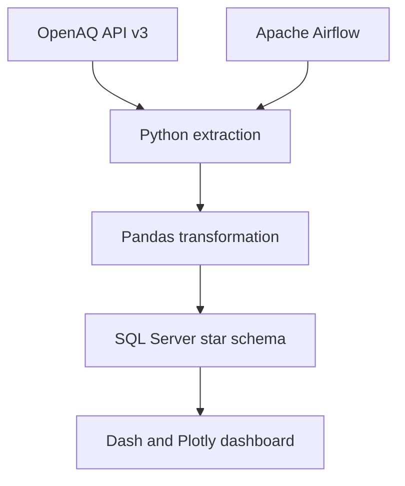

# Air Quality Data Warehouse

[](https://www.python.org/)
[](https://airflow.apache.org/)
[](https://www.microsoft.com/sql-server)
[](LICENSE)

An end-to-end data warehouse for monitoring PM10 and PM2.5 levels in Poland. The project extracts live data from the OpenAQ API, transforms it into a star schema, loads it into Microsoft SQL Server, schedules daily updates with Apache Airflow, and exposes analytical views through a Plotly Dash dashboard.

## Architecture



PostgreSQL is used only as Airflow's metadata database. Analytical data is stored in SQL Server.

## Features

- live OpenAQ API v3 ingestion with pagination and rate-limit protection,
- geographic filtering to monitoring stations in Poland,
- one-time historical load for the previous 365 days,
- daily Airflow pipeline loading the previous 24 hours,
- Pandas-based normalization of nested API responses,
- SQLAlchemy and `fast_executemany` bulk inserts,
- SQL Server star schema with date, station, and pollutant dimensions,
- interactive national trends, station ranking, and station drill-down views,
- Docker Compose environment for SQL Server, Airflow, and PostgreSQL,
- generated API documentation in `docs/`.

## Data model

| Table | Purpose | Main fields |
| --- | --- | --- |
| `Fact_AirQuality` | Air-quality measurements | station, pollutant, value, timestamp, date key |
| `Dim_Station` | Monitoring-station metadata | name, coordinates, country |
| `Dim_Pollutant` | Pollutant dictionary | PM10 and PM2.5 |
| `Dim_Date` | Calendar dimension | date, year, month, day |

The current scheduled load appends measurements collected during a rolling 24-hour window. It does not yet enforce idempotency or implement Slowly Changing Dimensions.

## Technology stack

| Layer | Technology |
| --- | --- |
| Data source | OpenAQ API v3 |
| ETL | Python, Pandas, OpenAQ client |
| Orchestration | Apache Airflow |
| Data warehouse | Microsoft SQL Server 2022 |
| Database access | SQLAlchemy, pyodbc, Microsoft ODBC Driver 18 |
| Airflow metadata | PostgreSQL |
| Dashboard | Dash, Plotly |
| Environment | Docker Compose, uv |

## Quick start

### Prerequisites

- Docker with Docker Compose,
- an [OpenAQ API key](https://docs.openaq.org/using-the-api/api-key),
- at least 4 GB of free memory available to Docker.

### 1. Configure the environment

```bash
git clone https://github.com/poprostuadam/air_quality_dwh.git
cd air_quality_dwh
cp .env.example .env
```

Add your OpenAQ API key to `.env`. On Linux, set `AIRFLOW_UID` to the result of `id -u`.

The credentials included in `docker-compose.yaml` are development defaults. Change them before using the project outside an isolated local environment.

### 2. Start the infrastructure

```bash
docker compose build
docker compose up airflow-init
docker compose up -d
```

Check container health:

```bash
docker compose ps
```

### 3. Create the warehouse schema

This command recreates the fact and dimension tables and populates the date and pollutant dimensions:

```bash
docker compose exec airflow-scheduler python -m src.init_dwh
```

> **Warning:** `src.init_dwh` drops the existing warehouse tables before recreating them.

### 4. Run the historical load

```bash
docker compose exec airflow-scheduler python -m src.initial_load
```

The initial load requests up to 50 Polish monitoring locations and retrieves up to 365 days of measurements. API limits and data availability affect the final volume.

### 5. Enable the daily pipeline

Open Airflow at [http://localhost:8080](http://localhost:8080), sign in with the local development credentials `admin / admin`, and enable the `air_quality_etl_pipeline` DAG.

The DAG runs daily and processes measurements from the previous 24 hours.

## Dashboard

The dashboard runs on the host and connects to SQL Server at `localhost:1433`. Install [uv](https://docs.astral.sh/uv/) and Microsoft ODBC Driver 18, then run:

```bash
uv sync
uv run python -m dashboard.app
```

Open [http://localhost:8050](http://localhost:8050).

The dashboard provides:

- daily average PM10 and PM2.5 trends,
- the ten stations with the highest average PM10,
- historical measurements for a selected station.

## Development

Install all dependencies, including the development group:

```bash
uv sync --all-groups
```

Run linting and tests:

```bash
uv run ruff check .
uv run pytest
```

The database tests require a running SQL Server instance and valid database environment variables.

Generate the HTML API documentation:

```bash
uv run pdoc src dags dashboard -o docs
```

Then open `docs/index.html`.

## Project structure

```text
.
├── dags/
│   └── air_quality_dag.py     # Daily Airflow pipeline
├── dashboard/
│   └── app.py                 # Dash analytical application
├── src/
│   ├── api_client.py          # OpenAQ extraction
│   ├── config.py              # Environment configuration
│   ├── db_tools.py            # SQLAlchemy connection
│   ├── etl_measurements.py    # Data transformations
│   ├── init_dwh.py            # Star-schema creation
│   ├── initial_load.py        # One-time historical load
│   └── load_data.py           # Dimension and fact loading
├── tests/                     # Database integration tests
├── docs/                      # Generated API documentation
├── docker-compose.yaml
├── Dockerfile
├── pyproject.toml
└── uv.lock
```

## Data source

Air-quality measurements come from [OpenAQ](https://openaq.org/). Availability, coverage, units, and update frequency depend on the upstream providers represented by OpenAQ.

## Documentation

The extended project report is available in [ProjektHD.md](ProjektHD.md). Generated source-code documentation is stored in [docs/](docs/index.html).

## Roadmap

- make the daily load idempotent with a measurement key or upsert,
- implement SCD Type 2 for station metadata,
- add a dedicated dashboard service to Docker Compose,
- add isolated unit tests with mocked API and database connections,
- move development credentials entirely to environment variables.

## License

This project is available under the [MIT License](LICENSE).
